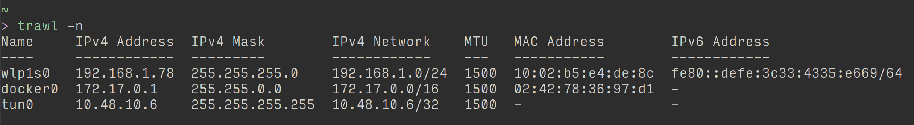

I recently wrote a small tool in Go, called
[Trawl](https://github.com/robphoenix/trawl), that prints out various
information about the network interfaces on your machine. The output is in a
columnar fashion, much like a csv file, as so:



Getting the output into that format has gone through a few iterations; firstly
static, then more dynamic and then I stumbled across Go's
[`tabwriter`](https://golang.org/pkg/text/tabwriter/) package, which made
everything better.

Initially all the column widths were static. An IP address will be at most 15
characters wide, `192.168.100.200`, a MAC address will be 17,
`10:02:b5:e4:de:8c`, etc. etc.

More problematic were the interface names. I built the tool to work on Windows
as well as Unix based systems, and Windows interfaces have ridiculously long,
but obvious, names like `Wireless Network Connection`, rather than something
short and less obvious like `wlp1s0`, the wireless interface on my Ubuntu
laptop. So I had to consider this variance in length, and did so by just
counting the longest interface names I encountered and setting the width to
that, which didn't take into account interfaces I hadn't, or wouldn't, encounter.
I know, I know, this is awful design/code, and did lead to
[issues](https://github.com/robphoenix/trawl/commit/99d61aceb9db64098db3e6ce254dcce0257bcfcb).
Anyway, it looked something like this;

The `String` method used for printing:

```go
func (iface *Interface) String() string {
	ifaceString := osString()
	return fmt.Sprintf(
		ifaceString,
		iface.Name,
		iface.IPv4Addr,
		iface.IPv4Mask,
		iface.IPv4Network,
		strconv.Itoa(iface.MTU),
		iface.HardwareAddr,
		iface.IPv6Addr,
	)
}
```

The `osString` function to determine what operating system the tool is being
used on:

```go
func osString() (s string) {
	switch os {
	case win:
		s = windowsString
	case linux:
		s = linuxString
	case darwin:
		s = darwinString
	}
	return
}
```

The static strings:

```go
windowsString     = "%-35s  %-15s  %-15s  %-18s  %-5s  %-17s  %s\n"
linuxString       = "%-10s  %-15s  %-15s  %-18s  %-5s  %-17s  %s\n"
darwinString      = "%-10s  %-15s  %-15s  %-18s  %-5s  %-17s  %s\n"
```

And looping through each interface, printing as we go:

```go
ifaces := getIfaces(loopback)

for _, iface := range ifaces {
    i, err := New(iface)
    if err != nil {
        log.Fatal(err)
    }
    fmt.Printf(i.String())
}
```

Horrible I know, but it got the tool built. Thankfully, refactoring happened.

I knew when writing this that it just would not do, so next iteration I got
dynamic. I realised that it was the interface names that were the main problem,
the element I didn't know in advance, and so couldn't predict, and that differed
across operating systems. So I left the other columns with static numbers and
spent more time than I would have liked working out how to format the string to
use a width not known in advance. This was kinda buried in the `fmt` package
[documentation](https://golang.org/pkg/fmt/) and took a bit of messing around on
the Go Playground to get it right, maybe I'm just slow on the uptake (person
shrugging emoji).

> Either or both of the flags may be replaced with the character '\*', causing
> their values to be obtained from the next operand, which must be of type int.

Let's have [an example](https://play.golang.org/p/zbR3If0Zku):

```go
name := "rob"

// here we're saying we want the width to be 10 characters
// and we're going to pad with zeroes just so it's visually clearer
s1 := "%010s\n"
fmt.Printf(s1, name)

// now we're going to replace the 10 with an asterisk and provide the
// width we want in the Printf statement
s2 := "%0*s\n"
// Note the width comes first, to build the verb before it can accept
// the string
fmt.Printf(s2, 15, name)

// output
// 0000000rob
// 000000000000rob
```

Okay, easy enough, when you know how. So, armed with this knowledge I added an
extra _for loop_ to find the maximum width of all the interface names and
[committed](https://github.com/robphoenix/trawl/commit/fd3899f562fb296ba67676608b9cb80e97819cee).
My code now looked something like so:

The new dynamic string, the only one, no matter what your OS:

```go
outputString := "%-*s  %-15s  %-15s  %-18s  %-5s  %-17s  %s\n"
```

I replaced the `String` method with this function (still getting to understand
when to use a function and when to use a method):

```go
func ifaceString(l int, i *Iface) string {
	return fmt.Sprintf(
		outputString,
		l,
		setMissingValue(i.Name),
		setMissingValue(i.IPv4Addr),
		setMissingValue(i.IPv4Mask),
		setMissingValue(i.IPv4Network),
		setMissingValue(i.MTU),
		setMissingValue(i.HardwareAddr),
		setMissingValue(i.IPv6Addr),
	)
}
```

`setMissingValue` just replaces an empty string with a `-`, and `l` is the maximum
string length (column width), passed in here:

```go
var maxLen int
var ifs []*Iface

// build up our slice of interfaces,
// working out the longest interface name as we go
for _, iface := range getIfaces(loopback, filter) {
    i, err := New(iface)
    if err != nil {
        log.Fatal(err)
    }

    ifs = append(ifs, i)

    if nameLen := len(i.Name); nameLen > maxLen {
        maxLen = nameLen
    }
}

// now we know how long the interface name column needs to be
// we can print all the interfaces out.
for _, i := range ifs {
    fmt.Printf(ifaceString(maxLen, i))
}
```

Super, I don't have to have sleepless nights now wondering if someone somewhere
is cursing me because they're output is ugly because they have a network
interface with a very very long name. Yay, win for software.

And then I somehow, don't remember how, found `tabwriter`, and all was good.

> Package tabwriter implements a write filter (tabwriter.Writer) that translates
> tabbed columns in input into properly aligned text.

This basically means it takes care of the boring formatting stuff for you. With
`tabwriter` you create a new writer, fill it with all your columns of data and
then flush it out, all nicely formatted. Sweet, shoulders of giants and all
that.

So, what does this mean for the code? Well, I reverted back to having a `String`
method, but replaced my static/semi-dymanic string with a simple tab separated
one, `"%s\t%s\t%s\t%s\t%s\t%s\t%s\t"`, like so:

```go
func (i *Iface) String() string {
	return fmt.Sprintf("%s\t%s\t%s\t%s\t%s\t%s\t%s\t",
		setMissingValue(i.Name),
		setMissingValue(i.IPv4Addr),
		setMissingValue(i.IPv4Mask),
		setMissingValue(i.IPv4Network),
		setMissingValue(i.MTU),
		setMissingValue(i.HardwareAddr),
		setMissingValue(i.IPv6Addr),
	)
}
```

I then create a `tabwriter.NewWriter`, load it up with all the interfaces, and
column headers (names) if needs be, and then flush it all out:

```go
w := tabwriter.NewWriter(os.Stdout, 0, 0, 2, ' ', 0)

if names {
    // add headers to the tabwriter
    fmt.Fprintln(w, tabbedNames())
}

for _, iface := range validInterfaces(loopback, filter) {
    i, err := New(iface)
    if err != nil {
        log.Fatal(err)
        return
    }
    // add each interface to the tabwriter.
    // I realised here as well that I don't need to specify
    // the String method, the print statement knows to use it
    fmt.Fprintln(w, i)
}
// flush out all the interfaces, printing them to stdout
w.Flush()
```

How nice is that, `tabwriter` I mean, heaven knows how amateurish my code is!
Needless to say it's a huge improvement on my original. I'm not sure if there's
a performance hit, when there's just a few interfaces there's no noticeable
difference in loading them all into the writer before flushing them out rather
than printing them as they are created. Maybe if someone was using it with a
substantial amount of interfaces then it might make a difference, but then if
that's the case, probably better using a standard GNU/Linux tool, yeah.

So what is it we actually pass in to create that new tabwriter? Here's the
`NewWriter` function signature:

```go
func NewWriter(output io.Writer, minwidth, tabwidth, padding int, padchar byte, flags uint) *Writer
```

The first thing we pass in is a writer, to specify where we want our output to
go, any type of writer interface will do. In my code above I pass in
`os.Stdout`, but we could just as easily output to a file, or anything that
implements the `io.Writer` interface.

Then we can pass in some formatting
options; `minwidth` is the minimum column width, `tabwidth` is the number of
spaces you want tab to be if you specify tab as the `padchar`, `padding` is the
number of cells you want to add to the contents of the cell before it's width is
computed, with this you can prevent data that might take up the entire cell from
butting up against the data in an adjacent cell, `padchar` is the ASCII
character to fill out the cell with, this can be any `byte` character, whether
that's a space, `' '`, a symbol, `'*'` or whatever. If you specify a tab
character here, `'\t'`, then the `tabwidth` will be used to determine it's
width.

Lastly there are some flags we can pass in. These flags are represented
by `uint` numbers, so if we don't want any flags we can just pass in `0`.
There's six flags, dealing with HTML, stripping escape characters, overriding
the default left alignment to align right (no centre alignment that I can see),
discarding empty columns, overriding `padchar` to always indent columns with
tabs and a handy `Debug` flag that sticks in a vertical bar, `|`, to distinguish
where your columns are.

Let's have a [play](https://play.golang.org/p/0R47HZD56T) with this then.

```go
func main() {
    // create a new tabwriter
    w := new(tabwriter.Writer)
    // we can initialise the tabwriter with
    // our preferred settings independently
    // of it's creation
    //
    // here we're outputting to stdout, with
    // right-aligned, space-separated columns,
    // with no padding, and we're going to add
    // the debug flag for a clearer visual output.
    w.Init(os.Stdout, 0, 0, 0, ' ', tabwriter.Debug|tabwriter.AlignRight)
    fmt.Fprintln(w, "A\tB\tC\tD\tE\tF\tG\t")
    fmt.Fprintln(w, "my\tvoice\tis\tmy\tpassport\tverify\tme\t")
    fmt.Fprintln(w)
    w.Flush()

    // we can re-initialise the tabwriter with
    // different settings if we like, let's just
    // add some padding so things aren't so cramped
    w.Init(os.Stdout, 0, 0, 2, ' ', tabwriter.Debug|tabwriter.AlignRight)
    fmt.Fprintln(w, "A\tB\tC\tD\tE\tF\tG\t")
    fmt.Fprintln(w, "my\tvoice\tis\tmy\tpassport\tverify\tme\t")
    fmt.Fprintln(w)
    w.Flush()

    // And for some real fun let's pad with a symbol
    w.Init(os.Stdout, 0, 0, 2, '*', tabwriter.Debug|tabwriter.AlignRight)
    fmt.Fprintln(w, "A\tB\tC\tD\tE\tF\tG\t")
    fmt.Fprintln(w, "my\tvoice\tis\tmy\tpassport\tverify\tme\t")
    fmt.Fprintln(w)
    w.Flush()

    // And finally let's have a tab-separated column,
    // with a tab-stop of 8
    w.Init(os.Stdout, 0, 8, 2, '\t', tabwriter.Debug|tabwriter.AlignRight)
    fmt.Fprintln(w, "A\tB\tC\tD\tE\tF\tG\t")
    fmt.Fprintln(w, "my\tvoice\tis\tmy\tpassport\tverify\tme\t")
    fmt.Fprintln(w)
    w.Flush()
}

// Output
//
//  A|    B| C| D|       E|     F| G|
// my|voice|is|my|passport|verify|me|
//
//    A|      B|   C|   D|         E|       F|   G|
//   my|  voice|  is|  my|  passport|  verify|  me|
//
// ***A|******B|***C|***D|*********E|*******F|***G|
// **my|**voice|**is|**my|**passport|**verify|**me|
//
// A	    |B		|C	    |D	    |E              |F      |G      |
// my	    |voice	|is	    |my	    |passport       |verify |me     |
```

Note that the `AlignRight` flag doesn't appear to make a difference in a
tab-separated column. Also note the `\t` at the end of the strings, making the
columns tab-terminated rather than tab-separated:

> Column cells must be tab-terminated, not tab-separated: non-tab terminated
> trailing text at the end of a line forms a cell but that cell is not part of
> an aligned column.

There you have it. `text/tabwriter` is a small, but useful package. A nice
little addition to my toolbox.
